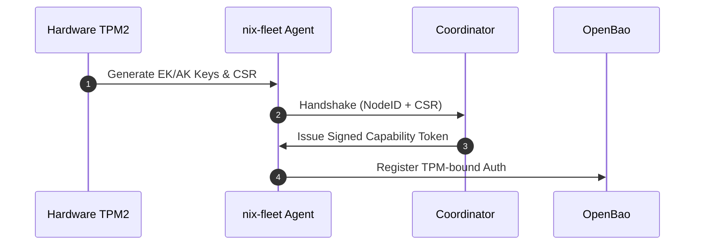
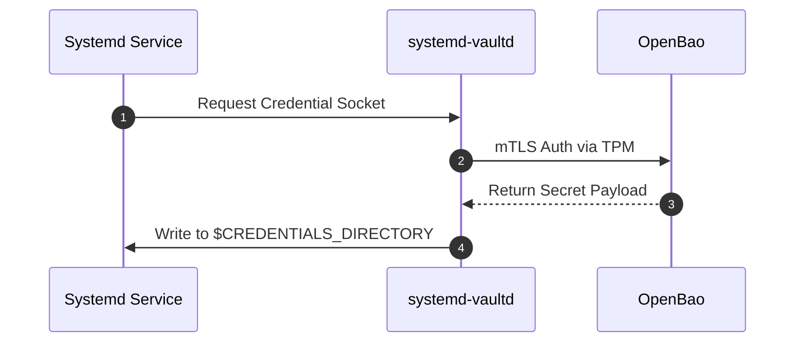
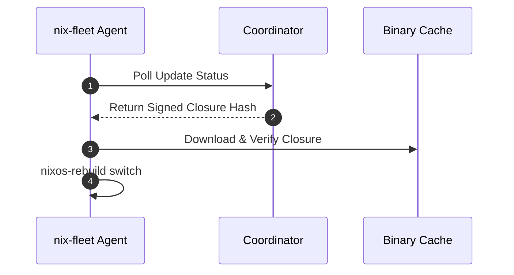
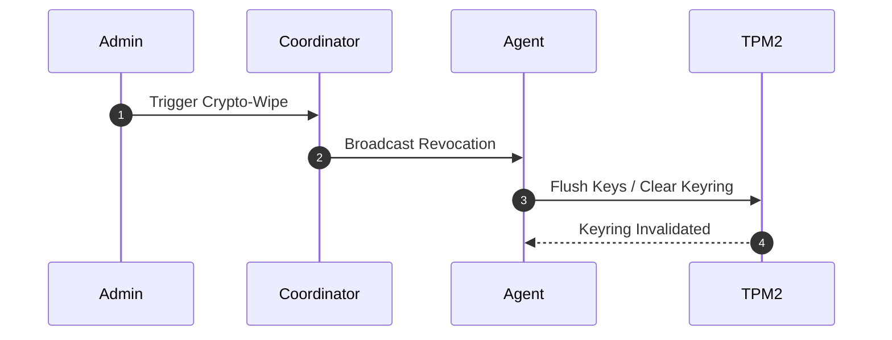

# RFC 001
A sovereign fleet infrastructure design document

## 1. Summary & Motivation

Traditional enterprise workstation and server management architectures rely on persistent inbound administrative listeners (such as SSH servers or centralized push orchestrators) and configuration data stored unencrypted in shared source repositories. These designs expose nodes to network interception, lateral movement, and compromise of the central orchestration plane.

This RFC specifies a decentralized, pull-based, hardware-authenticated infrastructure management framework. By combining OpenBao (Vault) for zero-trust secrets management, systemd-vaultd for in-memory credential injection, TPM2 PKI for hardware-rooted identity, and nix-fleet over Iroh P2P (QUIC) for state propagation, this architecture ensures that:

* Devices operate securely behind strict NAT or Carrier-Grade NAT (CGNAT) topologies without inbound listening ports.
* Secrets are never written to persistent disk storage or stored within Git repositories.
* Compromise of the control plane results in a scheduling outage rather than a credential data breach.

## 2. Protocol Graphs

### 2.1 Enrollment Phase

### 2.2 Secrets Fetching Phase

### 2.3 Update Loop Phase

### 2.4 Wipe Phase

### 3. Technical Specifications

Identity & Enrollment

* Bootstrapping: Devices utilize a hardware-secured TPM2 Endorsement Key (EK) to sign an initial X.509 IDevID certificate during factory installation or provisioning stage.
* mTLS Auth: OpenBao’s cert auth engine validates device certificates against an internal fleet Certificate Authority to issue scoped, short-lived session tokens.
* Key Protection: Private keys remain permanently isolated inside TPM NVRAM, bound strictly to verified Platform Configuration Register (PCR) measurement states.

Update Pipeline (nix-fleet)

* Transport Layer: Asynchronous peer-to-peer communication using Iroh (QUIC combined with UDP holepunching) bypasses NAT and CGNAT barriers without exposing inbound listening ports on the node.
* Payload Integrity: The agent enforces strict cryptographic signature checks on pre-built Nix store closures retrieved from the binary cache prior to executing nixos-rebuild switch.

Secret Injection (systemd-vaultd)

* Socket Mechanism: systemd-vaultd exposes a local Unix domain socket mapped directly to systemd's native LoadCredential specification.
* Lifecycle & Memory Isolation: Target services block at startup until vault-agent resolves and writes the payload. Decrypted secrets exist exclusively in volatile memory ($CREDENTIALS_DIRECTORY mounted on tmpfs).