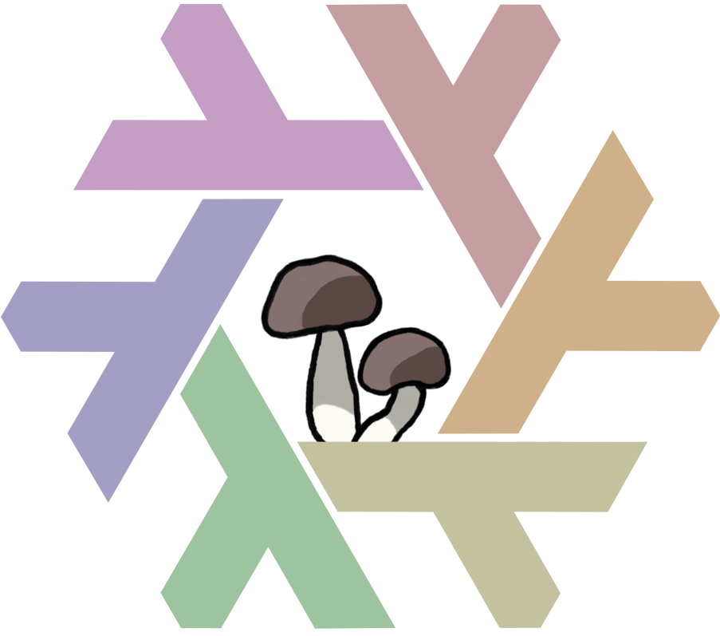

<!-- markdownlint-disable MD033 MD041 MD010 MD013 -->

<div>
  
  <div style="padding-left: 60px">
    <strong>
      <big>Luminarie</big>
    <br>
      <span style="font-size: small;">
        <a href="#contents">Contents</a> ·
        <a href="#usage">Usage</a> ·
        <a href="#license">License</a>
      </span>
    </strong>
    </div>
</div>

<p align="left">
  
</p>

<p align="left">
	<a href="https://github.com/sofiedotcafe/luminarie/stargazers">
		</a>
	<a href="https://github.com/sofiedotcafe/luminarie">
		</a>
	<a href="https://github.com/sofiedotcafe/luminarie/issues">
		</a>
  <a href="https://github.com/sofiedotcafe/luminarie/tree/main/LICENSE">
    </a>
  <br><a href="https://builtwithnix.org">
      </a>
</p>

> [!NOTE]  
> hii~ this flake is still evolving a lot! i'm slowly moving away from [nixpkgs](https://github.com/NixOS/nixpkgs) — partly because of [the recent moderation drama](https://discourse.nixos.org/t/the-sc-prepared-to-lie-to-us-and-what-we-can-do-about-it-whistleblow/70103) — and switching to [aux](https://auxolotl.org/) to [npins](https://github.com/nix-community/npins) for better pinning and reproducibility. flakes don't really have a standard...  
>
> i'm refactoring the whole modular setup to match the a little how [lix](https://lix.systems) and [aux](https://auxolotl.org/) do their infra. and eventually I want to migrate this project to use e.g. aux, they are also much nicer due to their queer values so a `arf arf`~ >:3 trans techwitch girl powered by lix (lesbian nix) would be greatly welcomed in that community 💜🩷🐾🏳️‍⚧️  

In this repo is the Nix ([Lix](https://lix.systems/)) Flake *Luminarie*, which contains the configurations for all my [NixOS](https://nixos.org)-based servers and desktops.

### Contents

```text
luminarie
├── hosts               # Configuration for specific hosts 
└── home                # Configuration for specific users
├── lib                 # Helpers
├── packages            # Overlays for Nixpkgs
├── packages            # Package definitions
├── modules             # Modules
│  ├── home             # Configuration modules for home-manager
│  ├── nixos            # Configuration for NixOS hosts
│  └── zfs-nopersist    # Configuration for a volantile zfs based filesystem
└── devshell            # Shell environment for the infra repo
```

### Usage

NixOS hosts and home-manager configurations are published as flake outputs.<br> These outputs can be then consumed and used by `nixos-rebuild` and `home-manager`.

You can use these configurations with, for example:

```sh
nixos-rebuild switch --flake github:sofiedotcafe/luminarie#azalea
```

and:

```sh
home-manager switch --flake github:sofiedotcafe/luminarie#sofie@azalea
```

You may also use [Just](https://just.systems/) to alias these longer commands.

---

### License

The code in this repository is licensed under the GNU General Public License v3 (GPLv3 or later). <br>For more details, see the [LICENSE](LICENSE) file.
